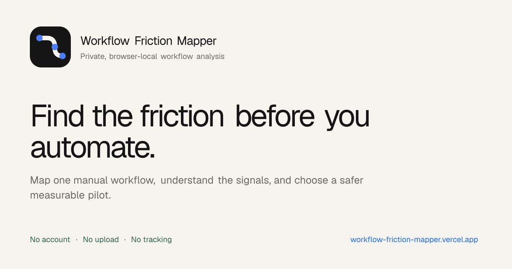
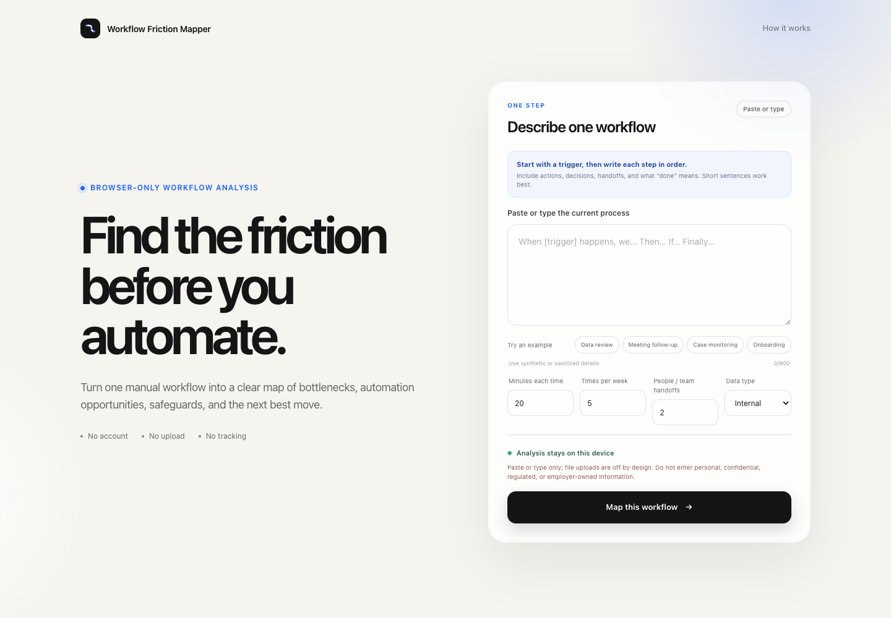
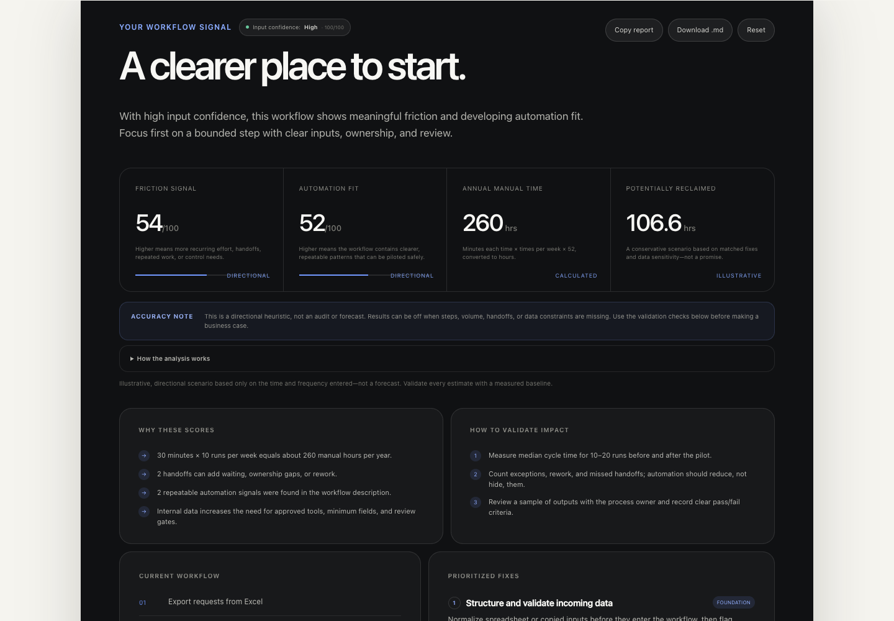
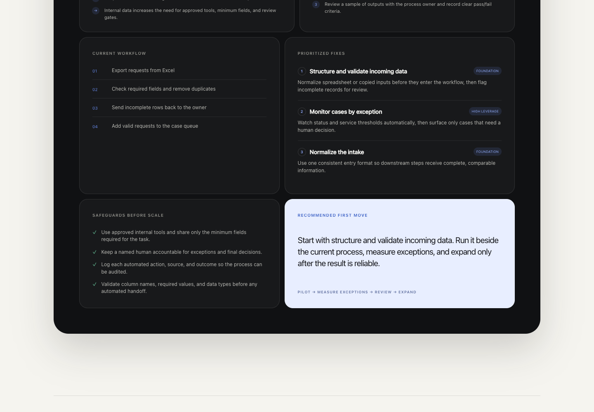
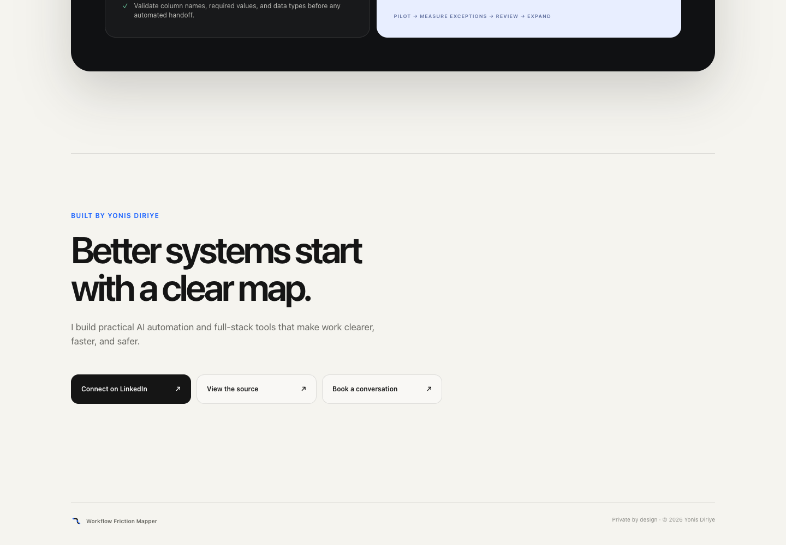

# Workflow Friction Mapper



A private, browser-only tool that turns one manual workflow into a clear map of friction, automation opportunities, safeguards, and the next best move.

**[Open the live tool](https://workflow-friction-mapper.vercel.app)** · **[View the source](https://github.com/Yasuui/workflow-friction-mapper)**

Built by [Yonis Diriye](https://www.linkedin.com/in/yonisdiriye/) as a practical demonstration of AI automation thinking, workflow design, privacy-aware product development, and full-stack execution.

## Why it exists

Teams often automate a process before they understand it. That can make unclear ownership, inconsistent data, and unnecessary handoffs move faster without making the system better.

Workflow Friction Mapper provides a lightweight first assessment. It helps a user:

- break a workflow into visible steps;
- estimate recurring manual effort;
- identify bounded automation opportunities;
- add safeguards before scale; and
- choose one measurable pilot instead of attempting a risky rewrite.

## How it works

1. **Describe:** enter a sanitized trigger, ordered steps, decisions, handoffs, completion state, time, and frequency.
2. **Map:** a deterministic browser-local engine turns the description into an ordered workflow.
3. **Explain:** the report shows calculated time, directional friction and automation-fit signals, input confidence, and the factors behind each result.
4. **Improve:** workflow-specific fixes are prioritized alongside safeguards and a bounded first pilot.
5. **Validate:** the report defines checks for cycle time, exceptions, rework, and output quality across real runs.

The tool does not call an AI model or send workflow text to a server. It is designed to improve the first automation conversation—not replace process owners, security review, or measured validation.

## Product views

### One-step workflow input



### Transparent KPI report



### Prioritized fixes and safer first move



### Direct contact and source actions



## Privacy by design

- No sign-in or account
- No API requests or AI model calls
- No database, cookies, analytics, or browser storage
- No workflow text leaves the browser
- Refresh clears the active input and report
- Sensitive-data warning appears before analysis

The report is deterministic and runs in the browser. See [PRIVACY.md](PRIVACY.md) for the full data-flow statement.

## What the report includes

- Directional friction and automation-fit signals with visible score drivers
- Illustrative annual manual hours and potential reclaimed time
- Ordered workflow map
- Prioritized fixes matched to the described workflow
- Data and human-review safeguards
- Recommended first pilot
- Three checks to validate cycle time, exceptions, and output quality
- Local copy and Markdown download actions

> Time estimates are illustrative. They use only the frequency and duration entered by the user and should be validated against a measured baseline.

## How to interpret accuracy

- **Calculated:** annual manual time is direct arithmetic from the entered minutes and weekly frequency.
- **Directional heuristic:** friction, automation fit, and potential reclaimed time are transparent heuristics—not predictions or audit findings.
- **Input confidence:** the report checks for a trigger, ordered steps, a completion state, time, and frequency. Weak input receives a low-confidence warning and specific correction prompts.
- **Validation required:** users should compare cycle time, exceptions, and output quality across 10–20 real runs before making a business case.

## Run locally

Requirements: Node.js 22.13 or newer.

```bash
npm install
npm run dev
```

Open `http://localhost:3000`.

## Verify

```bash
npm test
npm run lint
node --test tests/workflow-analysis.test.mjs
```

The checks cover deterministic analysis, workflow-specific recommendations, sensitive-data safeguards, server rendering, privacy boundaries, and starter-code removal.

## Product architecture

```text
One-step input
      ↓
In-browser deterministic analysis
      ↓
Workflow map + quantified signals
      ↓
Safeguards + recommended first pilot
      ↓
Copy or download locally
```

Core stack: Next.js, React, TypeScript, Tailwind CSS, and Vercel.

## Connect

- [LinkedIn](https://www.linkedin.com/in/yonisdiriye/)
- [GitHub](https://github.com/Yasuui)
- [Book a conversation](https://cal.com/yonis-diriye)

## License

[MIT](LICENSE)
