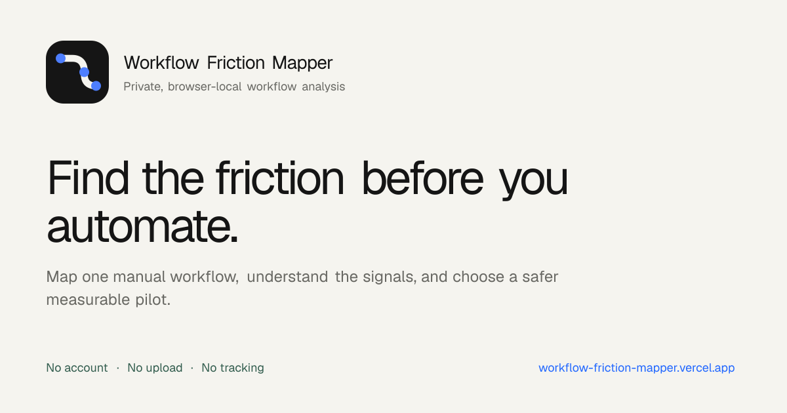
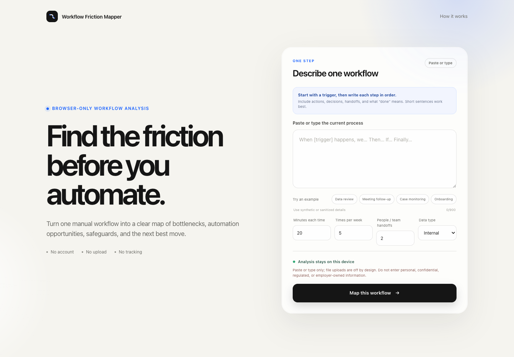
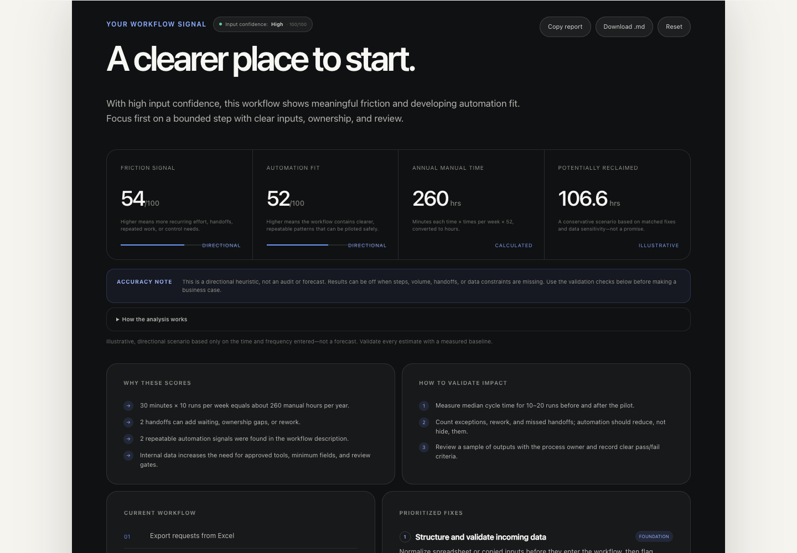
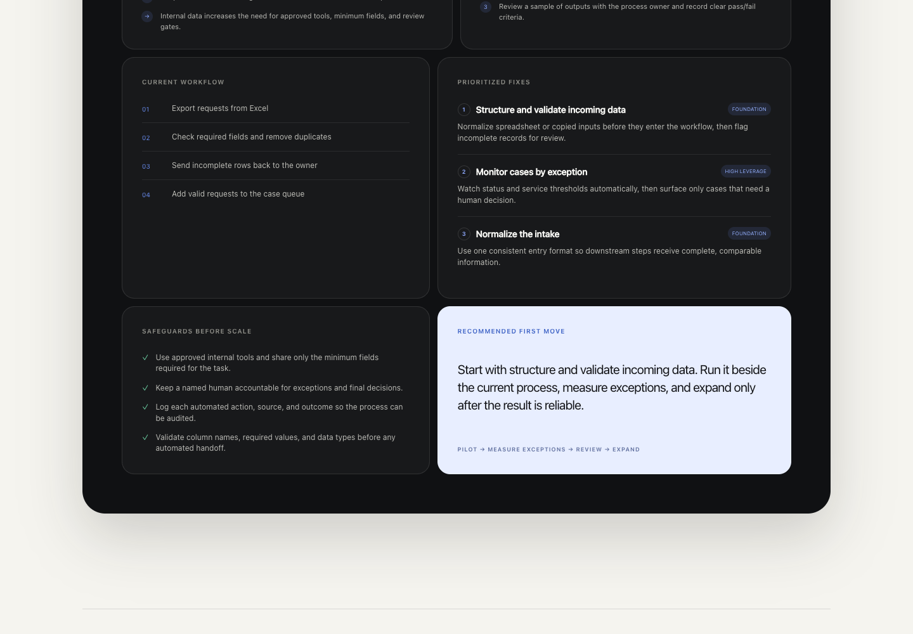
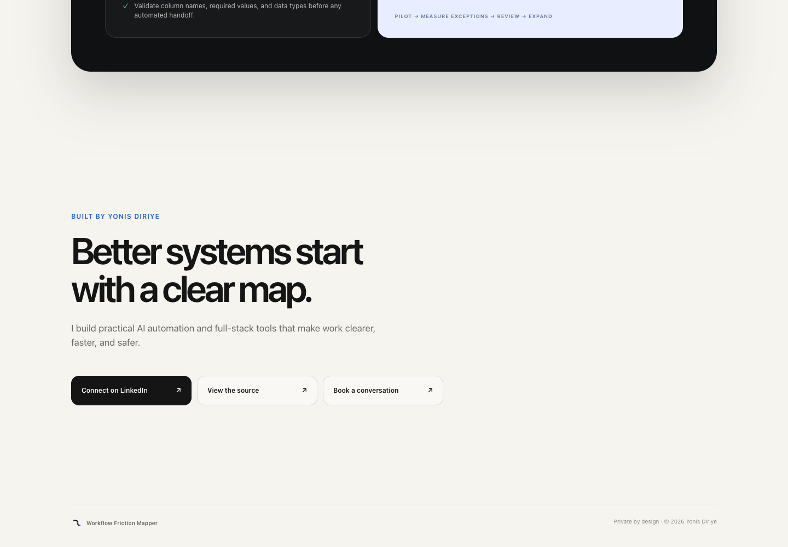

# Workflow Friction Mapper



A chat agent that reads a workflow you share and returns a grounded brief: friction, bottlenecks, opportunities, and a first move.

**[Open the live tool](https://workflow-friction-mapper.vercel.app)** · **[View the source](https://github.com/Yasuui/workflow-friction-mapper)**

Built by [Yonis Diriye](https://www.linkedin.com/in/yonisdiriye/).

## Why it exists

Teams often automate a process before they understand it. This agent is the first conversation: extract the real steps, name the friction, and pick one reversible move.

## How it works

1. **Land in chat.** The agent greets you. Paste a process, attach a SOP/notes file, or tap a starter.
2. **Read what you share.** Text, Markdown, CSV, JSON, and PDF text go to the optimizer. Images go to the live model when a key is present.
3. **Get a brief in the thread.** Spoken summary plus a structured report card. Claims are facts from your material or labeled inferences — no invented hours or tools.
4. **Take it with you.** Copy, download Markdown (`workflow-optimization-brief.md`), or download PDF (`workflow-optimization-brief.pdf`).

Without `OPENAI_API_KEY` the UI runs in **demo mode** (a polished streamed sample grounded in what you typed). With a key, `/api/optimize` uses **gpt-5-mini** (`MODEL`, fallback `gpt-4.1-mini`).

The tool does not replace process owners, security review, or measured validation.

## Product views

### One-step workflow input



### Transparent KPI report



### Prioritized fixes and safer first move



### Direct contact and source actions



## What is and is not collected

- No account
- Chat messages and attachments are sent to `/api/optimize` so the agent can read them
- In live mode that content is sent to the model provider (OpenAI)
- Cookieless, explicit-event-only product analytics; no autocapture or session replay
- Workflow text is never sent to PostHog

See [PRIVACY.md](PRIVACY.md). Analytics definitions live in [docs/analytics-event-contract.md](docs/analytics-event-contract.md).

## What the brief includes

- Ordered current steps
- Friction and bottlenecks with evidence (fact vs inference)
- Opportunities tied to named steps
- One first move
- Optional hours only when you stated volume
- Copy, Markdown, and PDF export

## Run locally

Requirements: Node.js 22.13 or newer.

```bash
npm install
npm run dev
```

Open `http://localhost:3000`. Demo mode works with no API key. To use the live model later, copy `.env.example` to `.env.local` and set `OPENAI_API_KEY` and `MODEL=gpt-5-mini`.

## Verify

```bash
npm test
npm run lint
```

## Product architecture

```text
Chat + attachments
      |
/api/optimize  (demo stream, or gpt-5-mini when keyed)
      |
Spoken reply + structured brief in-thread
      |
Copy / workflow-optimization-brief.md / .pdf
```

Core stack: Next.js, React, TypeScript, Vercel AI SDK, Tailwind CSS, and Vercel.

## Connect

- [LinkedIn](https://www.linkedin.com/in/yonisdiriye/)
- [GitHub](https://github.com/Yasuui)
- [Book a conversation](https://cal.com/yonis-diriye)

## License

[MIT](LICENSE)
